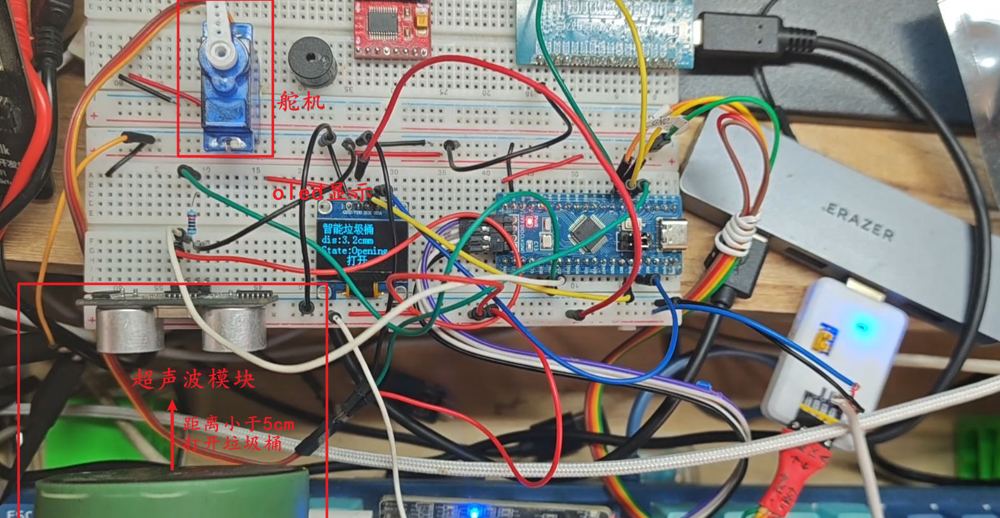
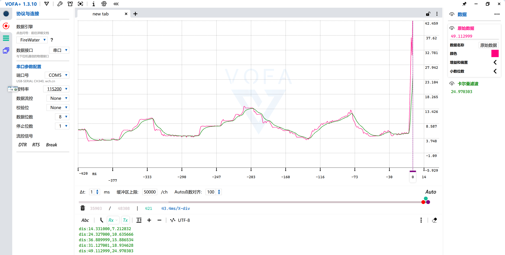

# 练习项目一、1.1智能垃圾桶(FreeRTOS版)

## 更新日志

### 阶段二：FreeRTOS 多任务实现 (2026-05)
- 引入 FreeRTOS，拆分为三个任务：超声波测距、舵机控制、OLED 显示
- 任务优先级：超声波/舵机/OLED 均为 Normal
- 控制逻辑：距离 < 10cm 开盖，保持 2 秒后关盖
- 卡尔曼滤波用于控制和显示，平滑数据
- 封装HCSR04 超声波模块/Servo 模块封装
- 更新OLED库，支持汉字显示

### 阶段一：裸机实现
- 基础功能：超声波测距 + 舵机控制 + OLED 显示
- 卡尔曼滤波降噪

---

## 一、项目思路
智能垃圾桶的整体思路是：通过超声波模块检测人体或物体是否靠近垃圾桶，当距离小于设定值时，主控芯片输出控制信号驱动舵机转动，从而带动桶盖自动打开；在垃圾投放完成后，延时一段时间再自动关闭桶盖。
同时，OLED 显示屏用于显示系统当前状态，例如“有人靠近”“桶盖打开”“桶盖关闭”“距离信息”等，让整个系统更加直观、智能。

### 项目分析
超声波模块(定时器)：trig out echo引脚
舵机（PWM）：PWM输出
OLED 显示屏：SCL SDA引脚
主控芯片：Stm32f103

### 技术要点
- 定时器PWM输出
- 定时器输入捕获、捕获中断处理
- OLED 显示汉字
- 一维卡尔曼滤波
- FreeRTOS 多任务调度
- 任务间通信（共享变量）

### 任务拆解（FreeRTOS 版本）
**1. 超声波测距任务 (ultrasonicTask, 优先级: Normal)**
  - 周期: 160ms (触发 + 60ms等待 + 100ms延时)
  - 流程: 触发测距 → 等待回波 → 读取距离 → 卡尔曼滤波 → 更新共享变量
  - 控制逻辑: 距离 < 10cm 开盖，保持 2 秒后关盖

**2. 舵机控制任务 (servoTask, 优先级: Normal)**
  - 初始化舵机到关闭位置 (0度)
  - 当前由超声波任务直接控制，后续可改为队列通信

**3. OLED 显示任务 (oledDSTask, 优先级: Normal)**
  - 周期: 100ms
  - 显示: 标题、距离、状态（开盖/关闭）
  - 读取共享变量 `g_distance_filtered` 和 `g_lid_state`
## 二、项目功能
1. 自动感应开盖
通过超声波模块检测垃圾桶前方目标距离，当有人靠近时自动打开桶盖。
2. 自动延时关盖
桶盖打开后保持几秒钟，方便投放垃圾，之后自动关闭。
3. 状态显示功能
OLED 实时显示垃圾桶当前工作状态，如待机、开盖、关盖、检测距离等。
4. 非接触使用
用户不需要手动接触桶盖，提高使用便利性和卫生性。
## 三、硬件组成
1. 主控模块
作为系统核心，用于接收超声波传感器数据、处理逻辑并控制舵机和 OLED。

2. 超声波模块
用于测量垃圾桶前方目标距离，判断是否有人靠近。

**FreeRTOS 版本改进：**
- 增加数据有效性标志 `data_ready`
- `HCSR04_GetDistance()` 返回 -1 表示数据无效
- 任务中只处理有效数据，避免读取旧值


3. 舵机模块
用于驱动垃圾桶盖完成打开和关闭动作。

**接线:**
- 棕色线（GND）  →  GND
- 红色线（VCC）  →  外部5V
- 橙色线（信号） →  PA8（TIM1_CH1）


4. OLED 显示屏
用于显示系统运行状态、距离信息和提示内容。

**接线:** I2C (SCL, SDA)
**显示内容:** 标题、距离、状态（开盖/关闭）
**刷新周期:** 100ms

5. 电源模块
为主控、超声波、舵机和 OLED 提供稳定供电。
6. 垃圾桶机械结构
包括桶盖、舵机连接结构和安装支架，用于实现实际开盖动作。

### 项目实拍

[一维卡尔门滤波](UserLib/Basic/kalman_1d_filter.c)
```c
// 卡尔曼参数
static float xk = 0.0f; // 上一时刻最优估计值
static float Q = 0.01f; // 过程噪声
static float R = 0.2f;	// 测量噪声
static float Pk = 1.0f; // 上一时刻误差协方差

float klm(float zk)
{

	// 预测阶段
	float xk_ = xk;		// 预测状态,无速度，直接等于上一时刻值
	float Pk_ = Pk + Q; // 预测误差协方差
	// 更新阶段
	float Kk = Pk_ / (Pk_ + R); // 卡尔曼增益
	xk = xk_ + Kk * (zk - xk_); // 更新最优估计值
	Pk = (1.0f - Kk) * Pk_;		// 更新误差协方差

	return xk;
}

```

## 四、项目扩展部分
1. 垃圾满载检测
增加一个检测模块，用于判断桶内垃圾是否已满，并在 OLED 上提示。
2. 语音提示功能
加入语音播报模块，在开盖或满载时进行语音提醒。
3. 自动除臭功能
增加风扇或香氛模块，在垃圾投放后进行简单除味处理。
4. 分类垃圾功能
扩展多个投放口，结合不同传感器（openmv摄像头）实现垃圾分类投放。
5. 联网监测功能
加入 WiFi 或蓝牙模块，将垃圾桶状态上传到手机或管理平台。
