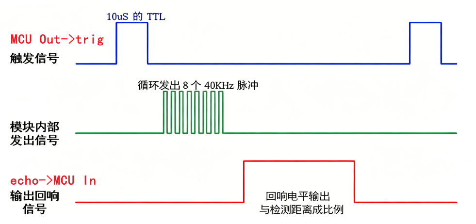
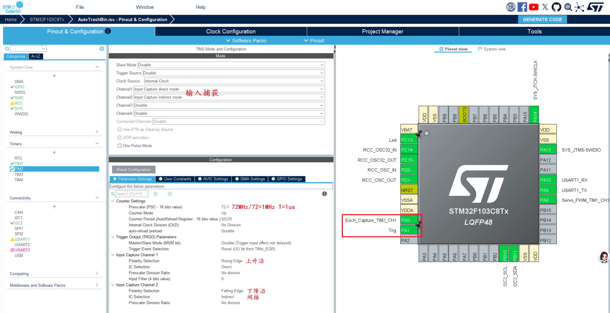
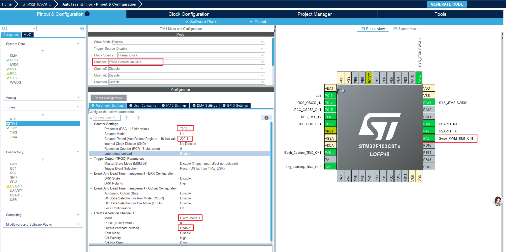

# 练习项目一、1.1智能垃圾桶
## 一、项目思路
智能垃圾桶的整体思路是：通过超声波模块检测人体或物体是否靠近垃圾桶，当距离小于设定值时，主控芯片输出控制信号驱动舵机转动，从而带动桶盖自动打开；在垃圾投放完成后，延时一段时间再自动关闭桶盖。
同时，OLED 显示屏用于显示系统当前状态，例如“有人靠近”“桶盖打开”“桶盖关闭”“距离信息”等，让整个系统更加直观、智能。

### 项目分析
超声波模块(定时器)：trig out echo引脚
舵机（PWM）：PWM输出
OLED 显示屏：SCL SDA引脚
主控芯片：Stm32f103

### 技术要点
定时器PWM输出
定时器输入捕获、捕获中断处理
OLED 显示汉字
## 二、项目功能
1. 自动感应开盖
通过超声波模块检测垃圾桶前方目标距离，当有人靠近时自动打开桶盖。
2. 自动延时关盖
桶盖打开后保持几秒钟，方便投放垃圾，之后自动关闭。
3. 状态显示功能
OLED 实时显示垃圾桶当前工作状态，如待机、开盖、关盖、检测距离等。
4. 非接触使用
用户不需要手动接触桶盖，提高使用便利性和卫生性。
## 三、硬件组成
1. 主控模块
作为系统核心，用于接收超声波传感器数据、处理逻辑并控制舵机和 OLED。

2. 超声波模块
用于测量垃圾桶前方目标距离，判断是否有人靠近。


```c
uint32_t upEdge = 0;   // 上升沿捕获的时间（us）
uint32_t downEdge = 0; // 下降沿捕获的时间（us）
float distance = 0.0;
//开启了tim2全局中断，定时器中断回调函数
void HAL_TIM_IC_CaptureCallback(TIM_HandleTypeDef *htim)
{
  if (htim->Instance == TIM2 && htim->Channel == HAL_TIM_ACTIVE_CHANNEL_2)
  {

    upEdge = HAL_TIM_ReadCapturedValue(htim, TIM_CHANNEL_1);
    downEdge = HAL_TIM_ReadCapturedValue(htim, TIM_CHANNEL_2);
    distance = (float)((downEdge - upEdge) * 0.034 / 2);
  }
}
```
3. 舵机模块
用于驱动垃圾桶盖完成打开和关闭动作。
SG90舵机           STM32F103C8T6        外部电源

棕色线（GND）  →    GND引脚            →  GND
红色线（VCC）  →    连外部5V             →  5V
橙色线（信号）   →    PA8（TIM1_CH1）

```c
  HAL_TIM_PWM_Start(&htim1, TIM_CHANNEL_1);
  while (1)
  {
    __HAL_TIM_SetCompare(&htim1, TIM_CHANNEL_1, duration);
    HAL_Delay(100);
  }
```
4. OLED 显示屏
用于显示系统运行状态、距离信息和提示内容。
i2c SCL SDA引脚  STM32F103C8T6  外部电源
- 驱动增加了汉字显示功能

5. 电源模块
为主控、超声波、舵机和 OLED 提供稳定供电。
6. 垃圾桶机械结构
包括桶盖、舵机连接结构和安装支架，用于实现实际开盖动作。

### 项目实拍

## 四、项目扩展部分
1. 垃圾满载检测
增加一个检测模块，用于判断桶内垃圾是否已满，并在 OLED 上提示。
2. 语音提示功能
加入语音播报模块，在开盖或满载时进行语音提醒。
3. 自动除臭功能
增加风扇或香氛模块，在垃圾投放后进行简单除味处理。
4. 分类垃圾功能
扩展多个投放口，结合不同传感器（openmv摄像头）实现垃圾分类投放。
5. 联网监测功能
加入 WiFi 或蓝牙模块，将垃圾桶状态上传到手机或管理平台。
